今天的计划是一天都在大阪游览

首先第一站就是大阪市区最有名的景点——大阪城公园  
由于我是从京都过来的，因此我根据导航坐地铁到森之宫站，感觉这个站人比较少，可能大多数人到大阪城不会从这里走

但是大阪地铁还是挺人性化地给出了去大阪城公园的方向

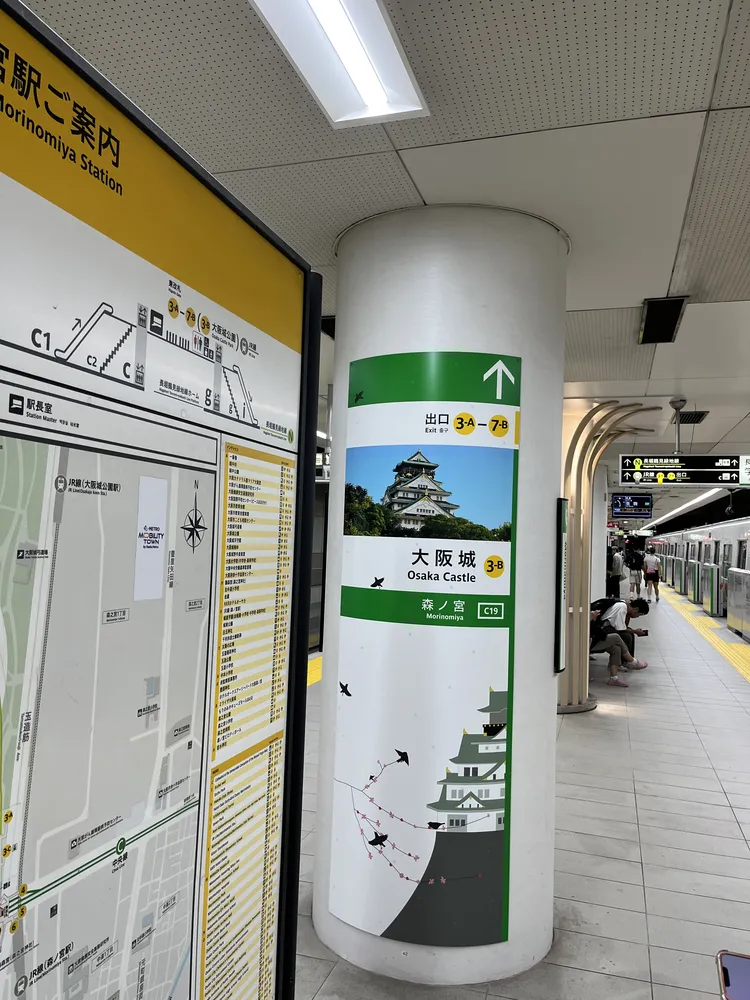

大阪城入口的栏杆还是挺有特色的，感觉应该是阻止自行车进去用的

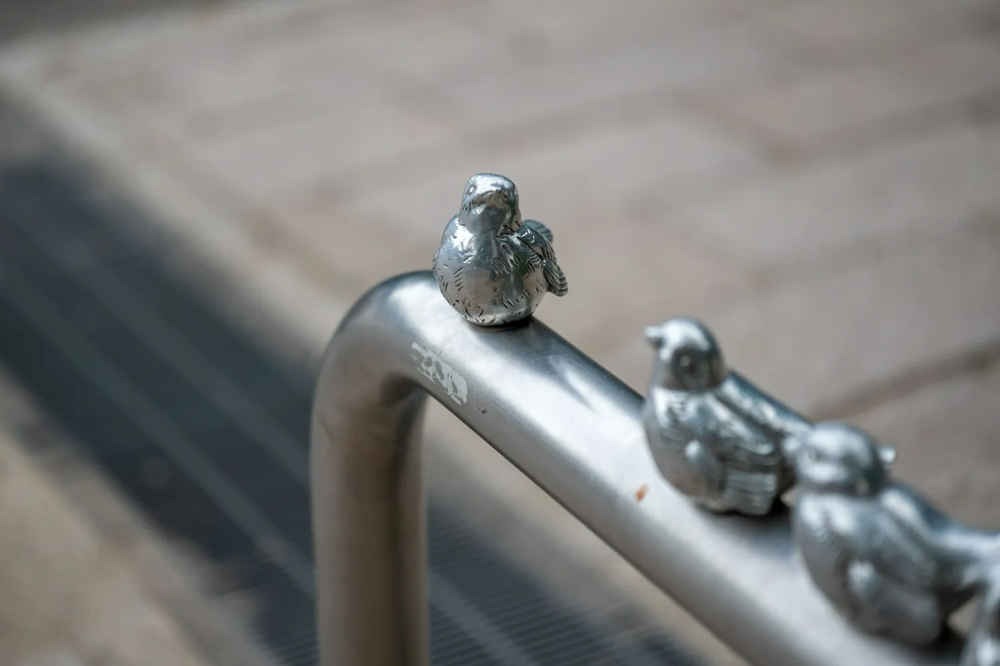

那么下面便是大阪城本城了

这个建筑叫做天守阁。说到这个天守阁还是挺有意思的，这个楼阁本来是丰臣秀吉建设的，但是后来德川家康重新占领了这里，把天守阁拆了换了一个风格重新建了一遍  
但是目前的天守阁是一个钢筋混凝土建筑，所以可想而知，目前这个建筑是一个近现代建筑……但是其风格既不是丰臣秀吉最开始的，也不是德川家康的，而是结合了两者风格的新建筑  
前两个版本的天守阁长什么样进去之后有展示，但是里面不允许拍照，各位想看可以进去看看

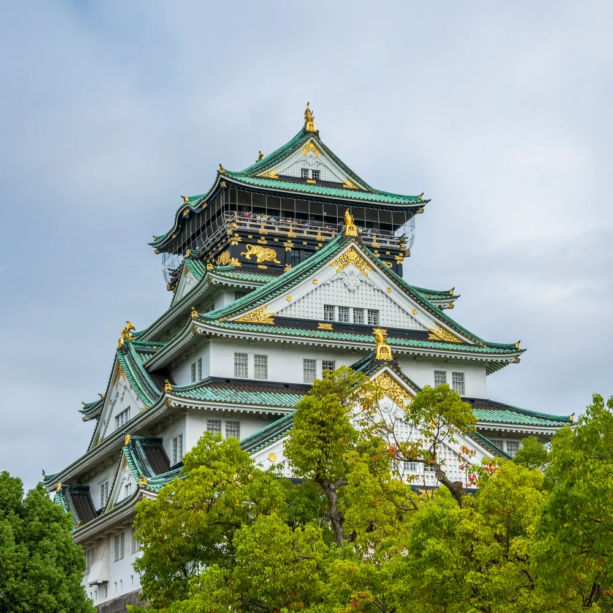

这里顺便一提，各位可以购买大阪周游券，里面包含进入天守阁的门票，楼顶的风景还是不错的

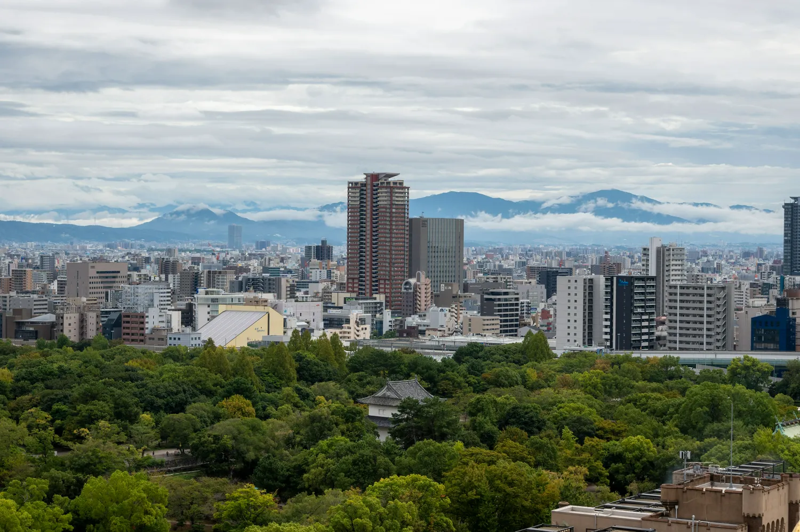

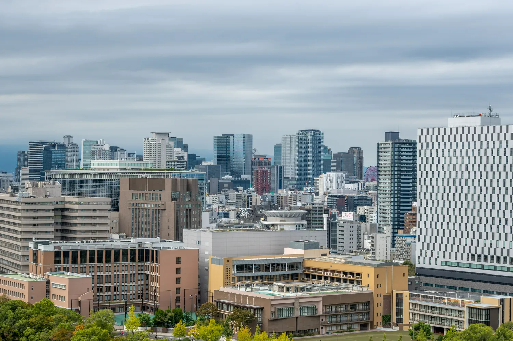

接下来去吃午饭，我打算去吃大阪最有特色的章鱼小丸子，根据ChatGPT给我推荐的店，这家店在叫做Takoyaki Wanaka，在难波中央街里  
说到这个章鱼小丸子，我个人觉得不太符合我的胃口，可能我不是很喜欢吃海鲜，但是新鲜出炉的，做得并不敷衍

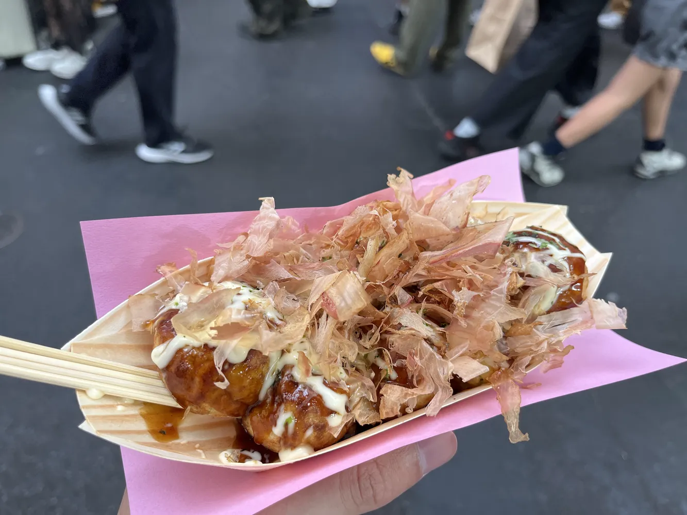

那么下一站我打算去梅田蓝天大厦观景台，这也算是大阪的地标建筑之一，虽然这栋楼高度并不是那么高（173米，相比国内大城市写字楼动辄200米来说并不高），但是这栋楼的设计很有特色，中间有两个镂空的电梯，非常有意思。

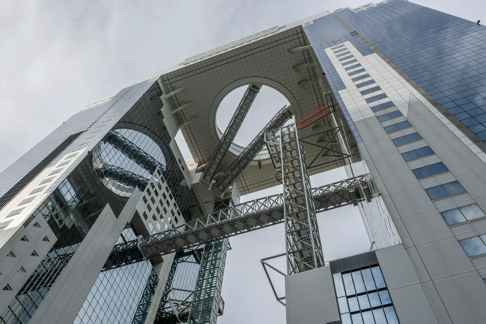

当时去排队的时候已经两点多了，虽然大阪周游券包含这个观景台，但是只允许下午三点前进入  
不过我后来问了一下工作人员，他们说三点半之前签到就可以了，算是勉强赶上了

非常凑巧的是我当时刚好站在第一个，所以可以直接拍到没有人的电梯照片，有种时空隧道的感觉

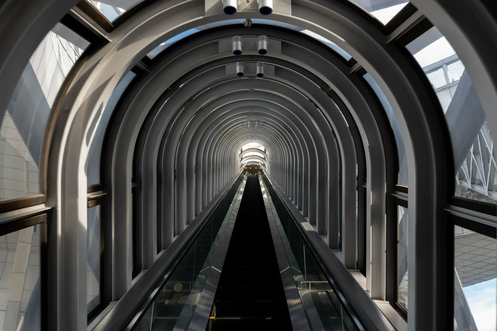

楼上的观景台体验也非常不错，可以看到大阪梅田地区鳞次栉比的写字楼，虽然高度都不是那么高（梅田蓝天大厦的高度是170多米，所有可以看到这些楼高度都不是很高），但是密度还是挺高的  
虽然下面有一个工地略微有一些煞风景

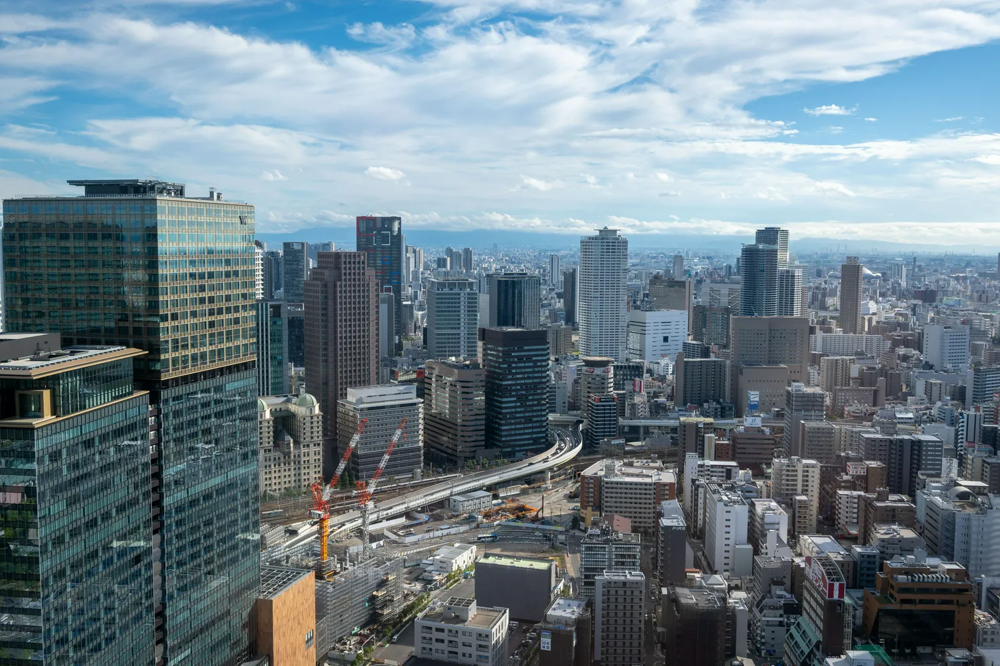

正中间有一个高架从楼中间穿过不知道各位看到没有，这栋楼是门塔大厦，穿过的道路是阪神高速，看着非常像是重庆的李子坝站（但是实际大阪这个建设的非常早，上世纪就通车了）

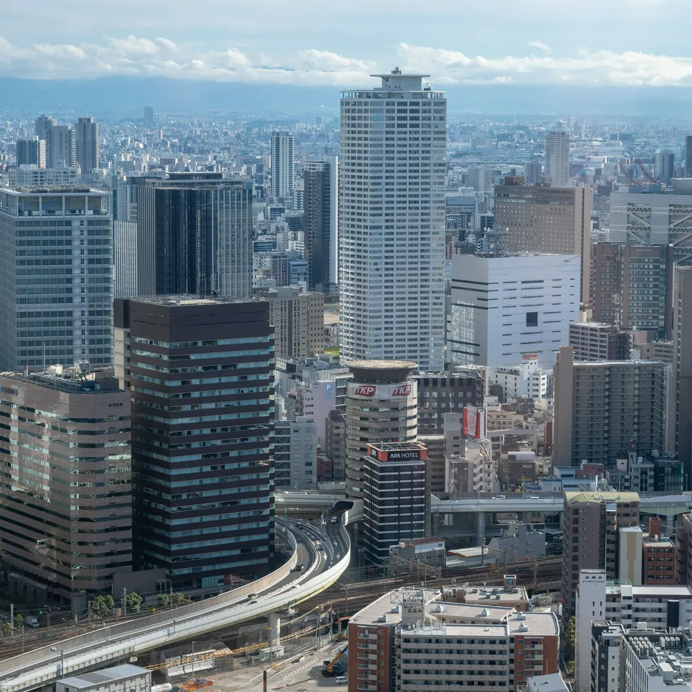

观景台的另一边是淀川，这条河也算是大阪的黄浦江了，这条河的上游之一是京都著名的鸭川，可以看出来横跨这条河的桥非常多，光是铁路桥就有不少

另外梅田蓝天大厦是可以直接去楼顶的，但是楼顶的景色没有什么区别，就是不用直对玻璃反光

接下来原计划是去天王寺动物园，但是虽然在谷歌地图上看这个动物园的关门时间是下午五点，但是下午四点就不让进去了，所以非常遗憾没有去成（也算是本次旅行之中唯一称得上的遗憾了）  
所以就暂时修改计划去旁边的阿倍野大厦观景台看看

阿倍野大厦的全名叫做Harukas 300，从名字就可以看出来这座楼的高度是300米，这也是曾经日本第一高楼（东京的晴空塔不属于楼）。其实天王寺周围的楼高度都不是很高，所以阿倍野大厦在这片区域非常独树一帜

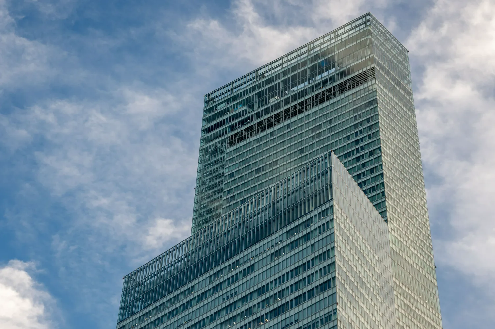

阿倍野大厦的楼顶观景台是收门票的，而且大阪周游券并不包含这个观景台。但是没关系，16楼的开放观景台是免费的，随时可以在这里看到大阪夜景

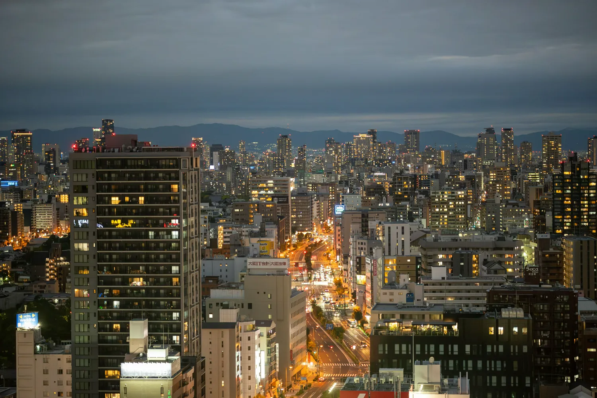

那么下一站就是通天阁，虽然天王寺到通天阁只有地铁一站的距离，但是用周游券免费，直接就坐过去了（但是发现在地铁站绕圈也挺费时间的……）

通天阁周围店的照片就以夸张而闻名，所以在日本这种非常遵守规矩的地方显得非常独特

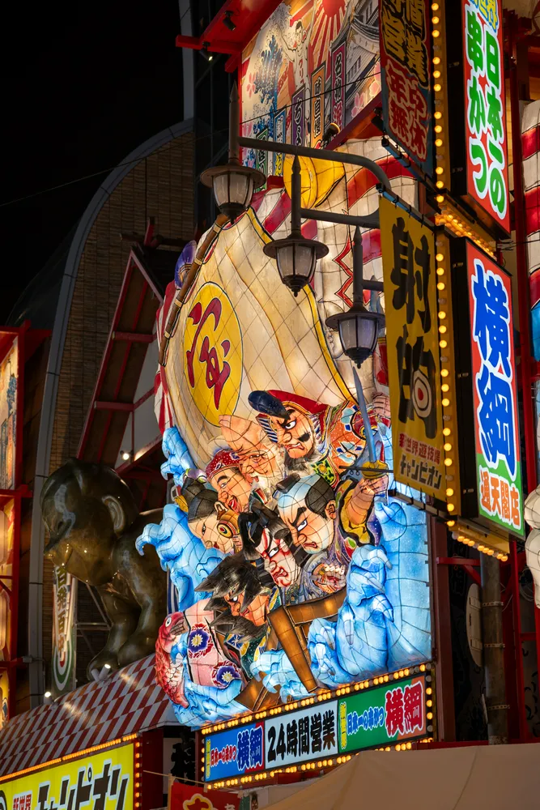

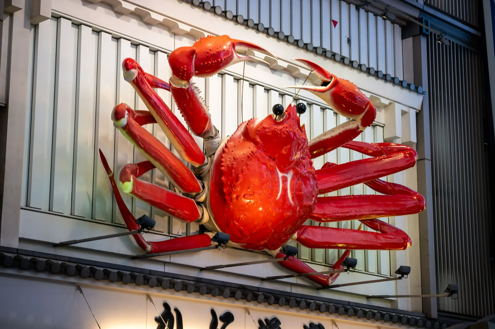

顺着通天阁那条步行街反过来走到头是一个楼梯，这个楼梯台阶上有一个大平台，上面拍照效果非常好，我用的是56mm（全画幅85mm）的镜头刚好可以拍到通天阁和下面的店铺  
顺带一提，当时这个大平台上有一个偶像团队在街头演出，围观的人不少哈哈哈哈

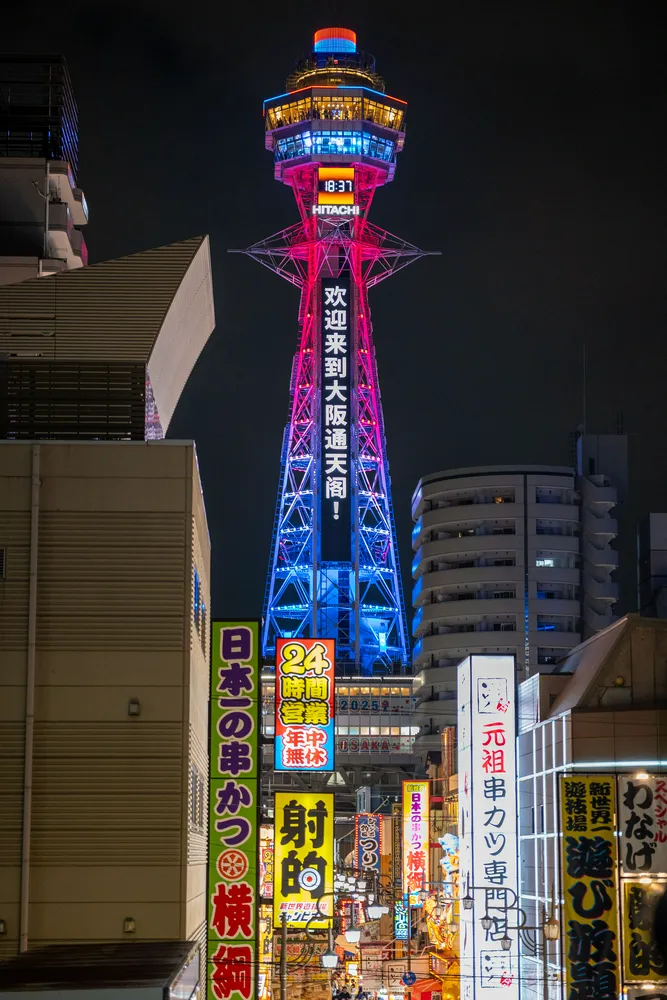

接下来去道顿堀逛逛，那里有可能是全世界最出名的广告牌——格力高广告牌，说真的我在日本从来没有见过那么多人，很难说这个地方有什么特色，唯一让我觉得有意义的就是拍张照让别人知道你到大阪了……

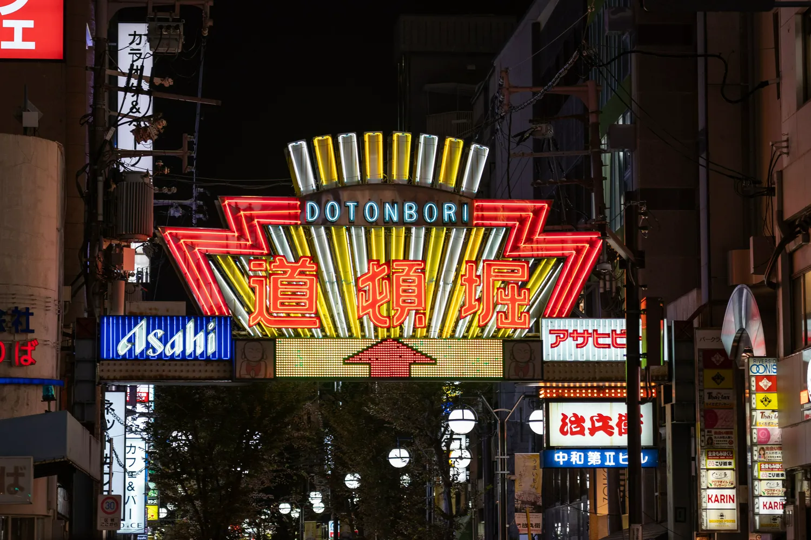

顺便一提，格力高这个品牌我之前都不知道是做什么的，我之前只是知道这个广告牌，所以让人第一印象以为是做运动器材相关的，结果没想到格力高主要是做食品相关的

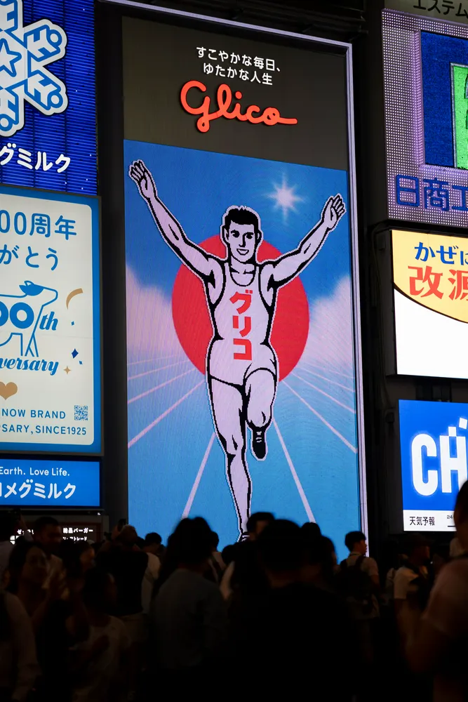

下面我打算去吃一下另一个大阪的美食——大阪烧  
其实我本来打算在心斋桥附近的大阪烧店，但是排队要一个多小时，于是选择了大阪车站附近的一家大阪烧店，叫做千房，原名叫做Chibo  
顺带一提这家店挺难找的，我找了半天才找到（梅田地下迷宫）

这个大阪烧我真的很喜欢，超级好吃，但是结算之后的账单也是真的心碎 💔

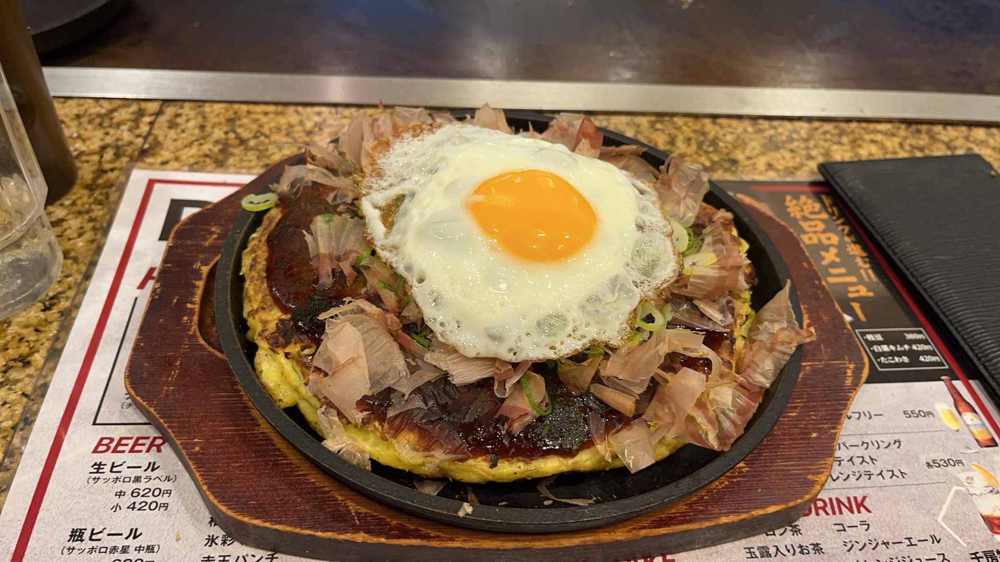

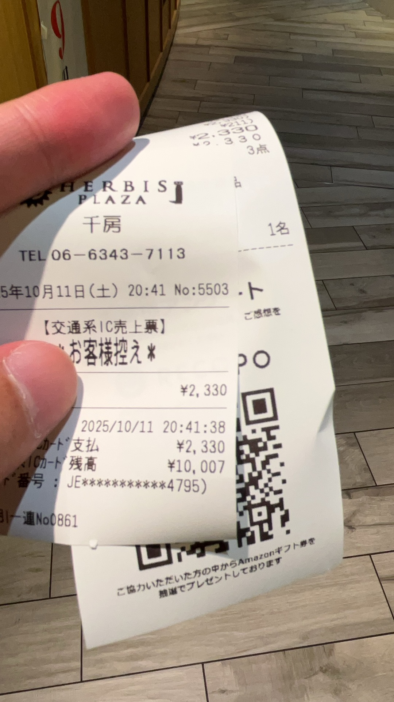

这一天的最后，我去Hep Five坐摩天轮  
说真的我印象中我从来没有坐过摩天轮，因为我有点恐高，但是既然来了，而且是包含在大阪周游券里的，那肯定要坐一次

说真的对恐高的人来说坐摩天轮还是有挑战的，加上摩天轮里面乌漆嘛黑，更是有点“惊悚”

在摩天轮里还可以看到大阪车站的全景  
另外我离开的时候它也提供了可以拍照的机位，挺出片的

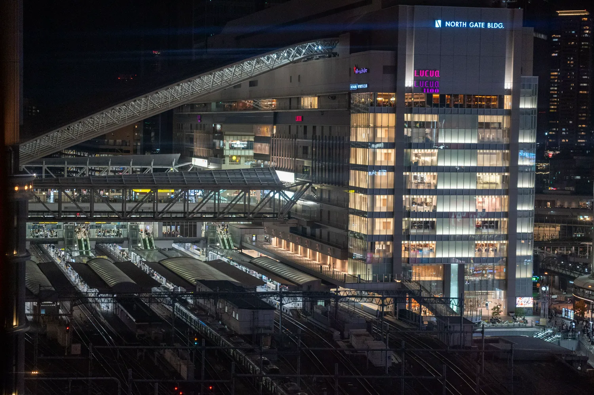

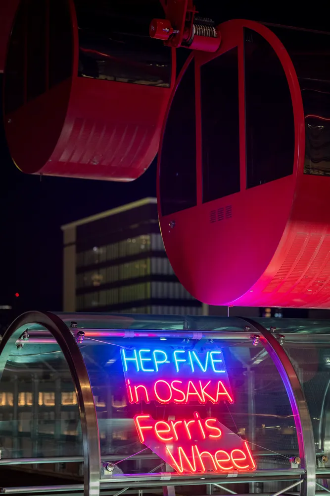