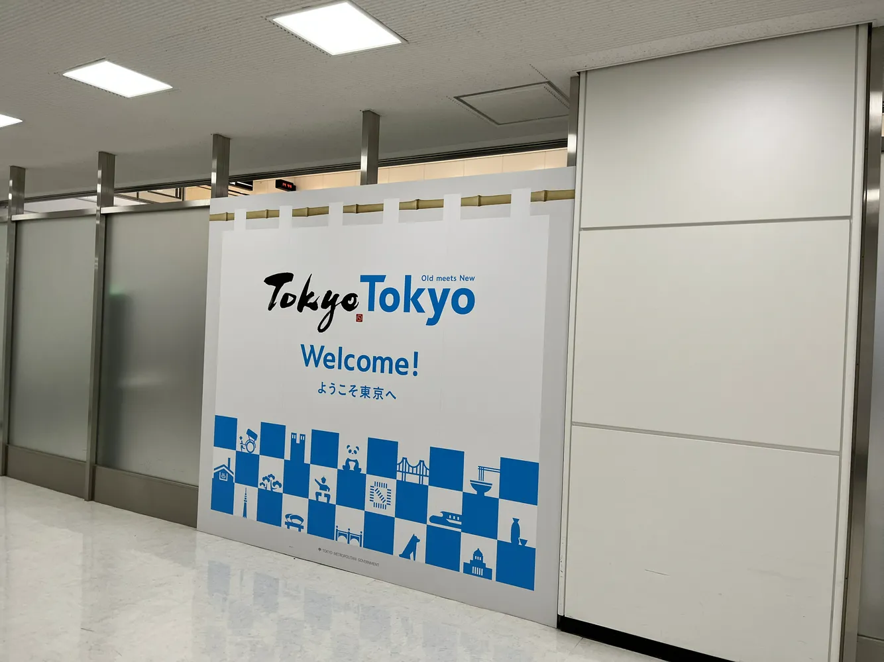
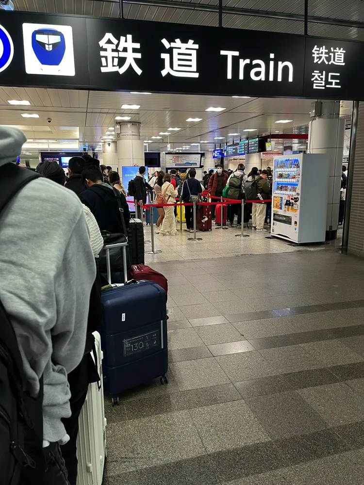
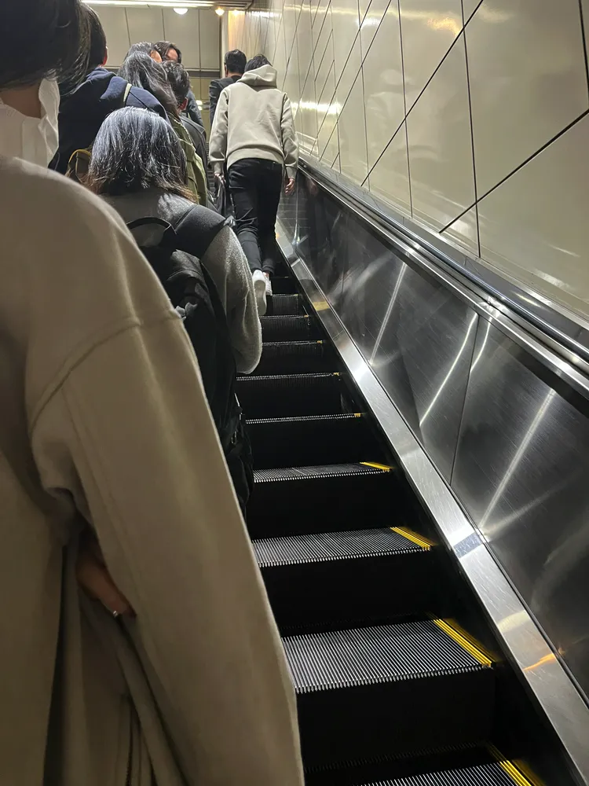
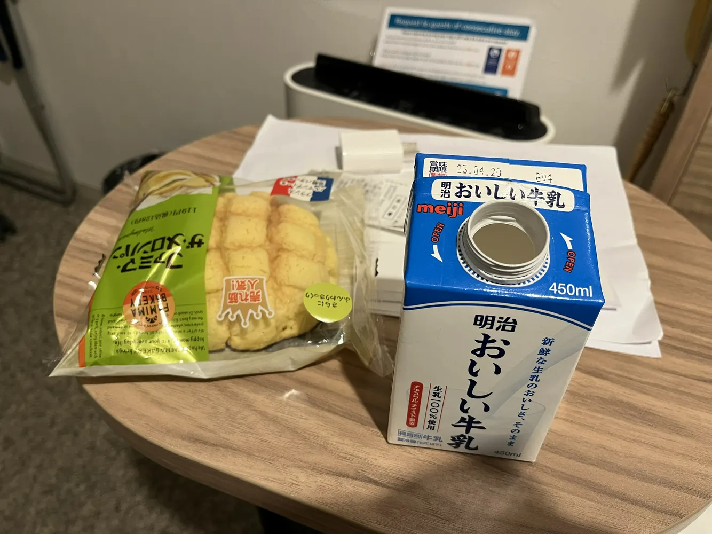

今天计划就随便溜达，毕竟到达第一天也没啥时间

成田机场的欢迎海报，顺带一提，东京的成田机场有一个外号叫做“成田分手”，指的是很多情侣去旅游一圈回国之后选择分手，因此如果你和你的另一半去旅游，记得选择羽田机场哦（开玩笑😂）

轨道交通在B1楼，这层的人非常非常多，虽然我手机上已经开通了一张西瓜卡，但是我需要拿一下我申请的JR Pass，我买的`东京广域Pass`

>[!NOTE] 东京广域Pass已绝版
> 如果你不是那种喜欢无聊坐火车的人，现在的JR Pass大多数是不划算的

在东京坐电梯左立右行，在电梯上也有标识让你站在左侧  
但是在关西地区（大阪、京都等城市）是反过来的，就很神奇

正值《铃芽之旅》在热播，第一时间去了作品其中一个原型地点，御茶之水车站 (御茶ノ水)  
这个车站本身也很有意思，上层是JR东日本的中央线/总武线，下层是地铁丸之内线

之前也提到了，我住在离晴空塔非常近的地方，到底有多近呢，出了酒店可以直接拍到晴空塔

当晚在车站旁边的711买了点东西当作第二天早的早饭（牛奶感觉喝不完，晚上先喝了点）  
另外也买了一个哈根达斯，日本这边哈根达斯是200日元一小盒，感觉定位像是国内的小布丁？（不知道各位有没有吃过，我觉得既便宜又好吃）

