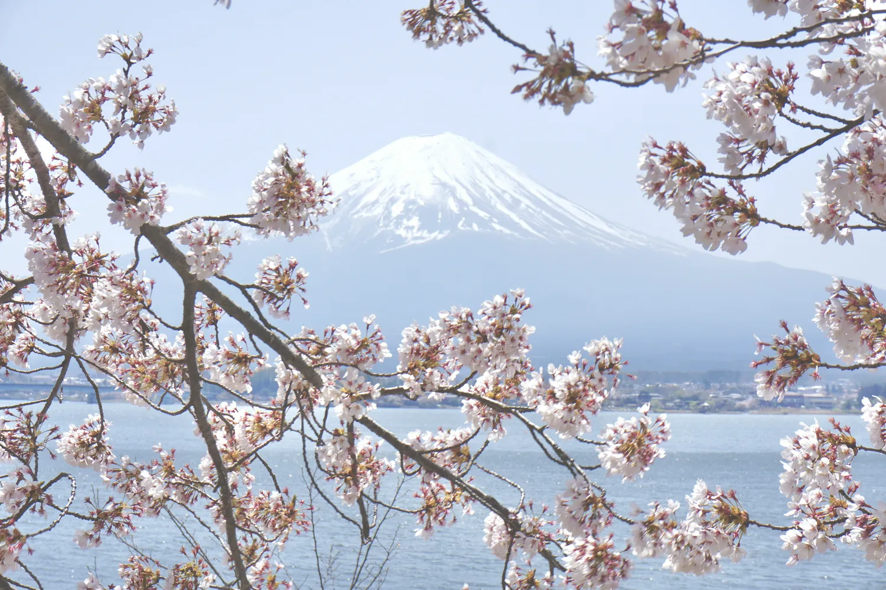
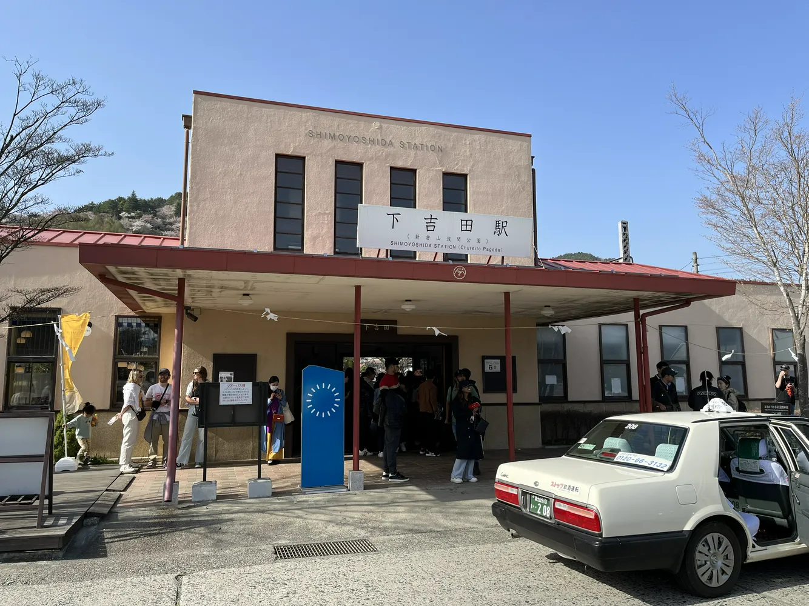
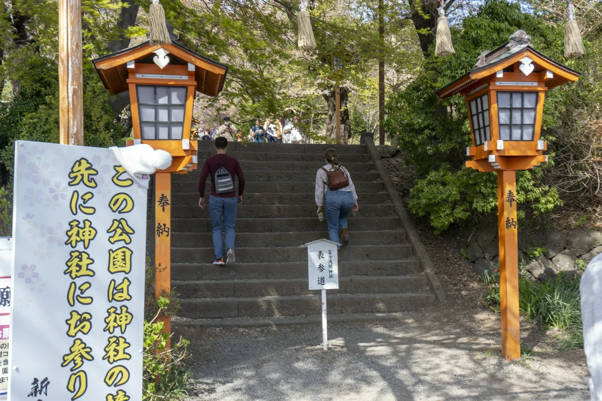
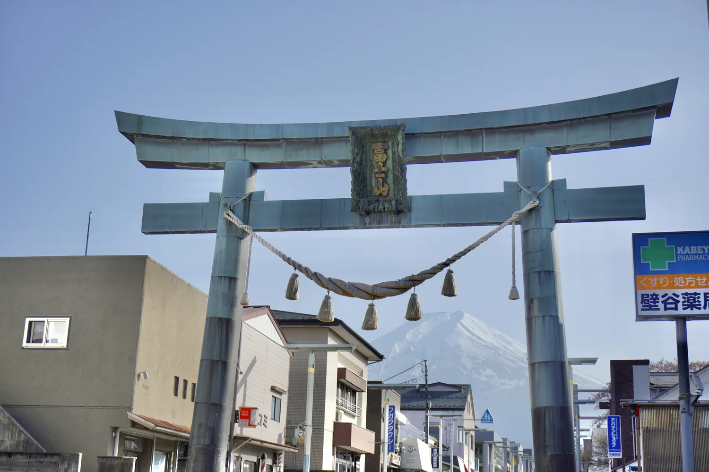
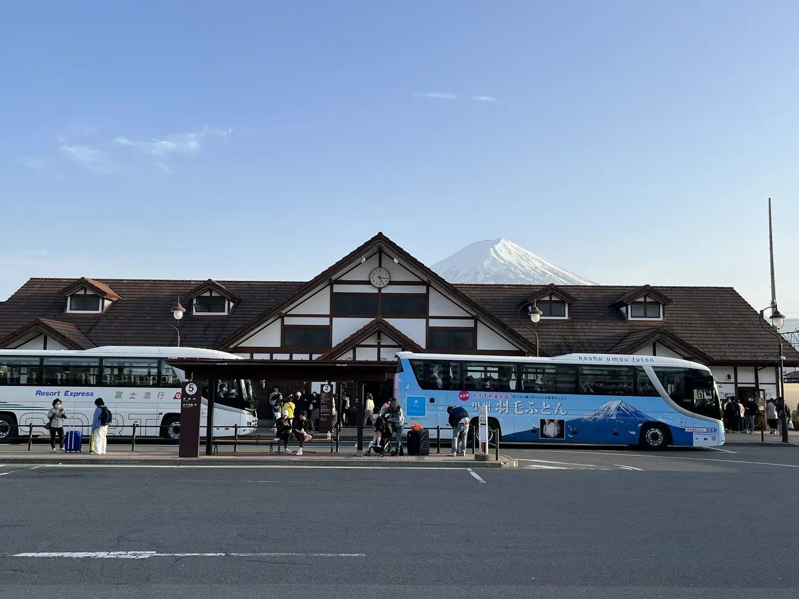
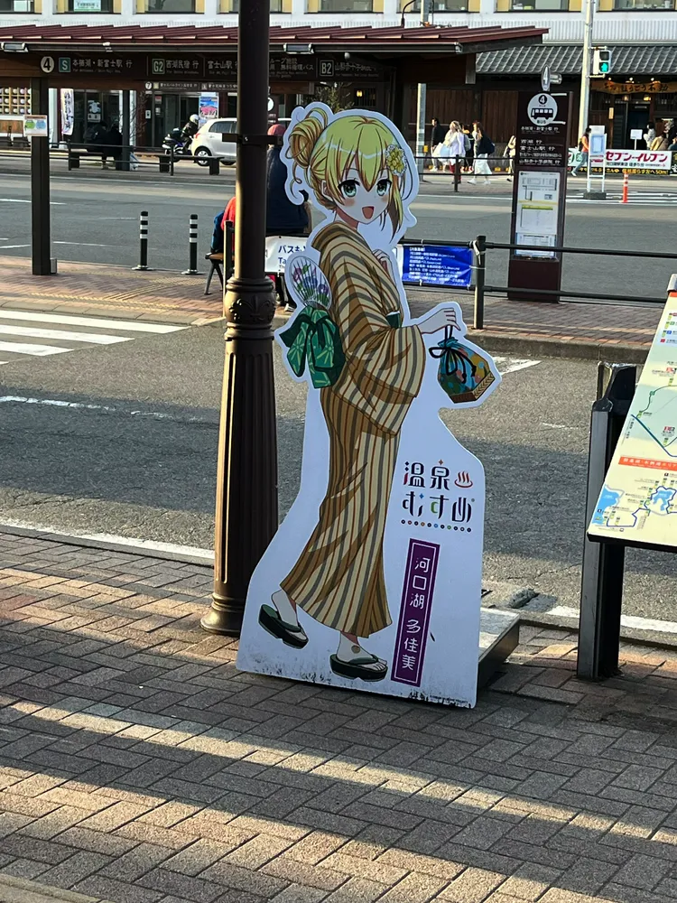

今天计划是去河口湖逛逛

乘坐的是前往河口湖站的Fuji Express，这个车乘坐的人非常多，我提早很久预约了  
刚好坐在左侧靠窗，在车上就可以看到富士山  
顺带一提，坐在我旁边的老哥是台湾人，和我聊了一路  
然后水杯就忘在火车上了……  
不知道为什么我旅游最容易丢的就是水杯，这是我丢的第三个水杯……

抵达河口湖站之后坐红线公交，这是一条游览线路，到达河口湖的北岸在哪下车其实都可以，我就照着地图随便找个地方下车  
河口湖这个地方还有一个吉祥物，还挺可爱的哈哈哈哈

下车之后走向湖边便是绝境，根据我来时火车站的那位台湾小哥说，我来的这个时候非常好，他来了三次这是天气最好的一天  
可以隐约看到路上堵车了 😂

感觉这里常驻人口应该非常少，沿着湖边的步道基本上都是游客，不过也能看到一些本地人  
而且四月也正值樱花开放的时候，天气又很好，湖边真的非常漂亮  

富士山绝景！  
（其实这张照片细看会发现我拍糊了，但是不妨碍远看真的挺好看的，被我妈拿去当微信头像了）

景区管理人员(?)放了一个手机架用于合影，但是中文有点机翻咯（上面写着“放心使用”）

由于这个地方出了这条步道附近以外荒无人烟，只能去旁边的罗森买个盒饭（最正宗的预制饭），但是我个人觉得味道不差，主要便宜

有一个当时我去的时候还没有特别火的富士山下的罗森，我甚至只是看到有人拍我也随便用手机拍了一张，这个地方周围有牌子不要驻足停留（私人土地），甚至有人会站在路上拍照，挺危险的，网上很多图都是重修过的

下一站我决定前往新仓山浅间公园，这个地方很多人都不知道，但是实际上在网上搜富士山，有很多图片都是在这里拍摄的，所以这个地方应该是出名，但是名字没那么出名。  
离这个公园最近的车站叫做下吉田站，这个车站真的好小，而且有种浓浓的历史感……  
这个车站其实离新仓山浅间公园有点距离，要稍微走几步

这个公园本质上是一座山，里面有一个小神社

深山老林里，虽然有这个牌子，但是野猪猴子我一个都没见着……

这是我第一次见到真的鸟居  
鸟居也有一个专门的emoji：⛩️  

爬到山顶之后，工作人员会要求所有人排队进入一个类似于拍合照的，有阶梯的地方，分成三排（我站在最后一排），所有人可以自由拍照五分钟，然后再进来下一批（工作人员反复用**地道的日式英语**说着“Five minites“，我当时差点没忍住笑出声）  
虽然有点纯打卡党的味道，但是不得不说这个做法挺人性化的，所有人都能拍到不错的照片，而且体验也不会很差  
背景下的这个城市叫做富士吉田市，在富士山周围，还有一个城市叫做富士市，但是这些城市规模都非常小，日本的市我觉得应该类似于中国的县

接下来就去另外一个看富士山的地方叫做金鸟居，这个地方知道的人好像就比较少了，但是这周围的景点基本都是围绕富士山景色的，既然来了就看看

这个金鸟居的位置我觉得应该是富士吉田市最繁华的地方，但是讲道理这个路上真的看不到什么人，也就车能零零散散看到一些，但是建筑密度却不低  
当初忘了因为什么事情需要用面巾纸，但是我带的面巾纸忘在酒店了，顺路就去买了一包  
顺带一提，日本没有中国那种一块钱一小包10抽的纸，只有那种一大包的，非常尴尬我只能买那一大包（印象中不便宜……但是挺柔和的）

因为我最后定的车票要从河口湖站回东京，所以我就又回到河口湖站准备回东京  
最后来看看河口湖车站的全貌  
东京的新宿也有很多大巴车可以直达河口湖站，各位如果来河口湖没有买到富士Express可以买大巴票

和多佳美说拜拜（绝了，吉祥物居然还有名字 😂）

